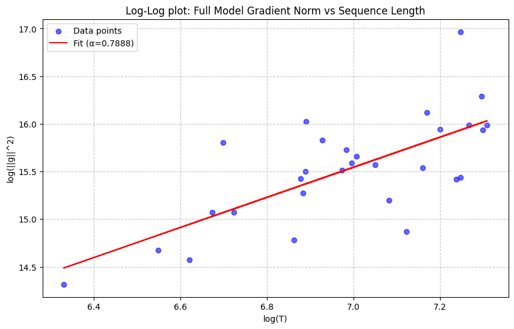

A question that has always bugged and fascinated me in reinforcement learning with language models is the duality of perspectives by which it can be viewed: as a long trajectory of token-level actions and with sparse final rewards, or as a single-action (bandit) environment where the entire answer is the action. This has repercussions on the way we do importance sampling, value modeling, KL penalties and - discussed in the following - reward baselines. 

By accounting for token gradient correlation within the same sequence, we derive an optimal $\mathrm{length}^\alpha$-weighted reward baseline. It naturally induces a stabilizing pessimistic bias recently shown to prevent training collapse in reasoning models in a theoretically justified manner. Experts can directly skip to the last sections.

## The Setup
Consider the REINFORCE estimator of the policy gradient
$$
\nabla_\theta J(\theta)
=
\mathbb{E}[r  \nabla_\theta \log \pi_\theta(a\mid s)] = \mathbb{E}[r g],
$$
writing $g \;:=\; \nabla_\theta \log \pi_\theta(a\mid s)$.

By the score identity, $\mathbb{E}[g] = 0$, so we can subtract any baseline $b$ that is independent of $a$ conditional on $s$ without introducing bias:
$$
\mathbb{E}[r g]
=
\mathbb{E}[(r-b)g].
$$

What is the optimal constant baseline $b$?

## Deriving the Optimal Baseline
The optimal baseline minimizes the trace of the covariance
$$
\operatorname{Tr} \operatorname{Var}((r-b)g)
= \operatorname{Tr} \operatorname{Cov}((r-b)g, (r-b)g) 
$$
with $g \in \mathbb{R}^d$ vector-valued.

Using bilinearity of covariance, we get:
$$
\operatorname{Tr} \operatorname{Var}((r-b)g)
=
\operatorname{Tr} \operatorname{Var}(rg) 
- 2b  \operatorname{Tr} \operatorname{Cov}(rg, g)
+ b^2  \operatorname{Tr} \operatorname{Var}(g).
$$

Setting the derivative by $b$ to zero leads to
$$
b^* = \frac{\operatorname{Tr} \operatorname{Cov}(rg, g)}{\operatorname{Tr} \operatorname{Var}(g)}
= \frac{\mathbb{E}[r\|g\|^2]}{\mathbb{E}[\|g\|^2]}
$$
because $\mathbb{E}[g] = 0$.

This makes intuitive sense: the variance-minimizing $b$ in $(r-b)g$ is not the average of $r$, but the average weighted by magnitude of $g$.

By default, in reinforcement learning we make the assumption that $r$ and $\|g\|^2$ are independent, in which case the term simplifies to the known $b^* = \mathbb{E}[r]$.

## Token-level vs Sequence-level Actions
Let us now get back to the two complementary views of RL with LLMs in terms of its action space.

For **token-level actions**, we use the reward-to-go for $r$ (which in many setups simply happens to be the final end of sequence reward for all tokens) and $g_t = \nabla_\theta \log \pi_\theta(a_t \mid s_t)$ is the gradient of the $t$-th token. Using the default $b = \mathbb{E}[r]$ baseline then reduces to taking a mean-baseline *at the token level* (each token receives the same weight, not each sequence). In other words, if $r_i$ is the reward of the $i$-th trajectory in GRPO and $T_i$ is its length, the baseline is
$$
b = \frac{\sum_i r_i T_i}{\sum_i T_i}.
$$ 
Our team has ablated and used this choice in Code World Model.[^1]

For **sequence-level actions**, the action is $a_{1:T}$, so the gradient is the sum of token gradients
$$
g = \nabla_\theta \log \pi_\theta(a \mid s) = \sum_{t=1}^T \nabla_\theta \log \pi_\theta(a_t \mid s_t) = \sum_{t=1}^T g_t.
$$
Crucially, the gradient magnitude therefore depends on the correlation between the $g_t$.

- If token gradients $g_t$ are **uncorrelated** and identically distributed, we have
    $$
    \|g\|^2 = \operatorname{Tr} \operatorname{Var} g = \sum_{t=1}^T \operatorname{Tr} \operatorname{Var} g_t = T \|g_1\|^2
    $$
    and $\|g\| \in \mathcal{O}(T^{1/2})$.
- If token gradients $g_t$ are **fully correlated**, we have $\|g\| \in \mathcal{O}(T)$.
- In practice, we expect growth between these extreme cases: $\|g\| \in \mathcal{O}(T^\alpha)$ with $\alpha \in (\frac{1}{2},1)$. (This reminds of $T^\alpha$ length penalties in decoding with early language models.)

The assumption of uncorrelated gradients again leads to the token-average baseline
$$
b
= \frac{\mathbb{E}[r\|g\|^2]}{\mathbb{E}[\|g\|^2]}
\approx
\frac{\sum_i r_i T_i}{\sum_i T_i}.
$$
Generally, the assumption of $\alpha$-scaling suggests a $T^{2\alpha}$-weighted mean baseline
$$
b^{(\alpha)}
= \frac{\mathbb{E}[r\|g\|^2]}{\mathbb{E}[\|g\|^2]}
\approx
\frac{\sum_i r_i T_i^{2\alpha}}{\sum_i T_i^{2\alpha}}.
$$

**Edit:** After writing, I learned of the OPO paper[^2] that covers makes the argument for the token-mean baseline with the same derivation.

## Initial Empirical Evidence
While out of big tech compute for now, let me present a quick measurement on the gradient scaling exponent with a small reasoning model.

We generate reasoning traces with DeepSeek-R1-Distill-Qwen-1.5B on 30 samples from the `orca-math-word-problems-200k` dataset, capping sequences at 1500 tokens. For each sample, we plot the reasoning trace length $T$ and the squared norm of the sequence gradient $\|g\|^2$. We compute the scaling coefficient $\alpha$ by linear regression in log-log space, where the slope equals $2\alpha$.

Our measurement indicates $\alpha \approx 0.8$ for this small model. If the trend holds for larger datasets and models, an $\alpha$-scaling weighted baseline might perform better than the current default baselines, without requiring additional compute.

## Context: Stability in RL via Baseline Shifts
In a recent paper by colleagues at FAIR,[^3] the authors find that adding a small negative bias to the GRPO sequence mean stabilizes training and prevents collapse. Concretely, they suggest setting
$$
b = \frac{1}{n} \sum_{i=1}^n r_i + \delta,
$$
where the average is the sequence-level mean baseline as in GRPO variance and $\delta$ is typically $-0.1$ for 0-1-rewards. The result is pessimism about the policy, i.e. advantages are positive on average, shifting the loss slightly in the direction of positive sample SFT.

Here, I'd like to make a speculative, heuristic argument for how this might relate to $\alpha$-scaling.

The main finding of reasoning models is that over the course of training, longer sequence lengths are correlated with higher rewards (both go up over the course of training). However, at any given point in training, longer response lengths are correlated with *lower* rewards: These are reasoning traces that "time out" and do not converge on a satisfactory solution for submission.

Hence, since $\alpha$-scaling upweighs long sequences in the baseline average (more than the token-mean baseline and even more than the sequence-mean one), we expect the $\alpha$-scaling baseline $b^{(\alpha)}$ to be *lower* than the default baselines. This amounts to a similar effect as adding negative $\delta$ as proposed in Asymmetric REINFORCE but now justified as a mechanism for optimal variance reduction. 

## Conclusion
Given the importance of training stability for truly scaling reinforcement learning post-training to pretraining levels of compute, we need to pay close attention to details in the reinforcement learning loss. The proposed gradient correlation-aware baseline is trivial to implement, empirically justified and could explain recent observations on training stability linked to baseline bias. Please go ahead and implement it and let me know of the results!

##  References

[^1]: Copet, Jade, et al. "CWM: An open-weights LLM for research on code generation with world models." [Arxiv 2025](https://arxiv.org/abs/2510.02387).

[^2]: Hao, Yaru, et al. "On-policy RL with optimal reward baseline." [Arxiv 2025](https://arxiv.org/abs/2505.23585).

[^3]: Arnal, Charles, et al. "Asymmetric REINFORCE for off-policy reinforcement learning: Balancing positive and negative rewards." [NeurIPS 2025](https://openreview.net/pdf?id=Ql3sENn0mi).

